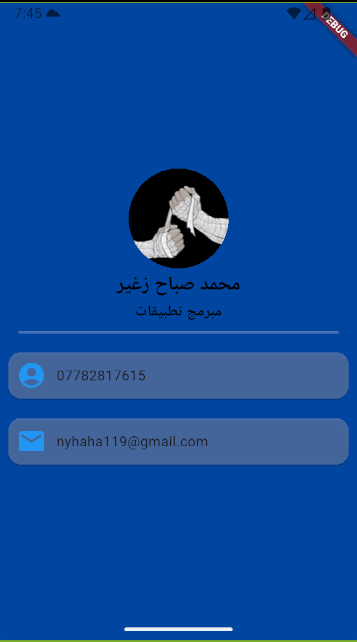

# Personal Introduction App

هذا أول مشروع إلي باستخدام **Flutter**، وهو تطبيق بسيط وأنيق يهدف إلى عرض معلوماتي الشخصية والمهنية بطريقة واضحة وسهلة.

فكرة التطبيق تشبه **بطاقة تعريف رقمية (Digital Business Card)** بحيث يقدر أي شخص يفتح التطبيق ويتعرف بسرعة على اسمي، عملي، وطرق التواصل وياي.

---

## صورة من التطبيق

---

## مميزات التطبيق

* عرض **الاسم والمجال المهني**
* عرض **رقم الهاتف**
* عرض **البريد الإلكتروني**
* واجهة بسيطة ونظيفة باستخدام **Material Design**
* تطبيق خفيف وسريع
* تصميم قابل للتطوير لمشاريع أكبر مستقبلاً

---

## التقنيات المستخدمة

* Flutter
* Dart
* Material Design

---

## هدف المشروع

هذا المشروع يمثل **بداية رحلتي في تطوير تطبيقات الموبايل باستخدام Flutter**.
من خلال هذا المشروع أهدف إلى تطوير مهاراتي في:

* بناء تطبيقات الموبايل
* تصميم واجهات المستخدم
* تنظيم الكود بطريقة احترافية
* استخدام أفضل الممارسات في تطوير التطبيقات

---

## التطوير المستقبلي

في المستقبل أخطط لإضافة:

* قسم لعرض المشاريع (**Portfolio**)
* روابط وسائل التواصل الاجتماعي
* تحسين التصميم وتجربة المستخدم
* إضافة حركات (Animations) وتفاعلات أكثر

---

هذا المشروع جزء من رحلتي في تعلم **تطوير تطبيقات Flutter**، وسيتم تطويره وتحسينه مع تقدّم خبرتي في هذا المجال.
